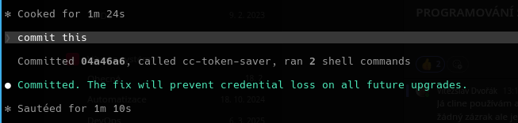

# CC Token Saver MCP

Reduce your Claude Code token usage by delegating simple tasks to a local LLM.

The MCP server exposes your local LLM as tools that Claude Code can call for:

- Code snippet generation and simple refactoring
- Unit test generation (pytest, unittest, jest, and more)
- Code explanation at beginner, developer, or expert level
- Documentation writing and code reviews
- Summarizing long texts, logs, and READMEs
- Generating Conventional Commits messages from diffs
- Text translation with markdown formatting preserved
- Listing and switching between locally available models

Claude Code routes simple, self-contained subtasks to the local LLM first,
only spending premium tokens on complex reasoning and multi-step workflows.

## Installation

### From Debian/Ubuntu package

```sh
apt install python3-cc-token-saver-mcp
```

### From source

```sh
pip install fastmcp openai python-dotenv
git clone https://github.com/Vitexus/cc_token_saver_mcp.git
```

## Configuration

### Local LLM

Create a `.env` file in the directory where you launch the server:

```ini
# Local LLM Configuration
OPENAI_API_KEY=none
OPENAI_BASE_URL=http://localhost:1234/v1
LOCAL_MODEL_NAME=qwen2.5-7b-instruct
LOCAL_LLM_TEMPERATURE=0.7
LOCAL_LLM_MAX_TOKENS=-1
```

| Variable | Default | Description |
|---|---|---|
| `OPENAI_API_KEY` | `none` | Key sent to the local endpoint (usually ignored) |
| `OPENAI_BASE_URL` | `http://localhost:1234/v1` | OpenAI-compatible API base URL |
| `LOCAL_MODEL_NAME` | `qwen2.5-7b-instruct` | Model name to request |
| `LOCAL_LLM_TEMPERATURE` | `0.7` | Sampling temperature |
| `LOCAL_LLM_MAX_TOKENS` | `-1` | Max tokens per response (`-1` = no limit) |

### Claude Code MCP config

If installed from the Debian package, add to `~/.claude.json`:

```json
"mcpServers": {
  "cc-token-saver": {
    "type": "stdio",
    "command": "cc-token-saver-mcp"
  }
}
```

If running from source, point to `server.py` instead:

```json
"mcpServers": {
  "cc-token-saver": {
    "type": "stdio",
    "command": "python",
    "args": ["<path>/cc_token_saver_mcp/server.py"]
  }
}
```

### Real-world example (Ollama + Debian package)

```json
"mcpServers": {
  "cc-token-saver": {
    "type": "stdio",
    "command": "/usr/bin/cc-token-saver-mcp",
    "args": [],
    "env": {
      "OPENAI_API_KEY": "none",
      "OPENAI_BASE_URL": "http://localhost:11434/v1",
      "LOCAL_MODEL_NAME": "qwen2.5-coder:7b",
      "LOCAL_LLM_TEMPERATURE": "0.7",
      "LOCAL_LLM_MAX_TOKENS": "-1"
    }
  }
}
```

This snippet comes from a real `~/.claude.json` running the Debian package against a local [Ollama](https://ollama.com) instance (`ollama pull qwen2.5-coder:7b`). LM Studio users only need to change `OPENAI_BASE_URL` to `http://localhost:1234/v1`.

## Tools

### `query_local_llm`

Send a prompt to the local LLM.

| Parameter | Type | Default | Description |
|---|---|---|---|
| `prompt` | `str` | required | The user prompt |
| `system_message` | `str` | helpful assistant | System message |
| `temperature` | `float` | env default | Override temperature |
| `max_tokens` | `int` | env default | Override max tokens |

### `query_local_llm_with_context`

Send a prompt with additional context (e.g. a code snippet).

| Parameter | Type | Default | Description |
|---|---|---|---|
| `prompt` | `str` | required | The task/question |
| `context` | `str` | required | Additional context |
| `task_type` | `str` | `general` | `code_review`, `documentation`, `refactor`, `general` |
| `system_message` | `str` | auto | Override system message |

### `list_available_models`

List all models installed in the local Ollama / LM Studio instance. No parameters.

### `switch_model`

Switch the active model for all subsequent calls in the current session.

| Parameter | Type | Description |
|---|---|---|
| `model_name` | `str` | Model identifier (e.g. `qwen2.5-coder:7b-16k`) |

### `summarize_text`

Produce a concise summary of a long text to save tokens on large file contexts.

| Parameter | Type | Default | Description |
|---|---|---|---|
| `text` | `str` | required | Text to summarize |
| `max_words` | `int` | `150` | Target summary length |
| `focus` | `str` | `""` | Aspect to emphasise (e.g. `"security issues"`) |

### `generate_commit_message`

Generate a Conventional Commits message from a `git diff` output.

| Parameter | Type | Default | Description |
|---|---|---|---|
| `diff` | `str` | required | Output of `git diff --staged` |
| `extra_context` | `str` | `""` | Motivation or ticket reference |

### `generate_unit_tests`

Generate boilerplate unit tests for a given code snippet.

| Parameter | Type | Default | Description |
|---|---|---|---|
| `code` | `str` | required | Source code to test |
| `framework` | `str` | `pytest` | Test framework (`unittest`, `jest`, `go test`, …) |
| `extra_instructions` | `str` | `""` | Additional guidance |

### `explain_code`

Explain what a piece of code does in plain language.

| Parameter | Type | Default | Description |
|---|---|---|---|
| `code` | `str` | required | Code to explain |
| `audience` | `str` | `developer` | `beginner`, `developer`, or `expert` |

### `translate_text`

Translate text to another language, preserving markdown and code-block structure.

| Parameter | Type | Default | Description |
|---|---|---|---|
| `text` | `str` | required | Text to translate |
| `target_language` | `str` | required | Language name (e.g. `Czech`, `German`) |
| `preserve_formatting` | `bool` | `True` | Keep markdown structure intact |

## CLAUDE.md Integration

You can instruct Claude Code to **automatically** delegate commit message generation to the local LLM by adding a rule to `~/.claude/CLAUDE.md`:

```markdown
## Commit Message Generation

When creating a git commit, ALWAYS generate the commit message via the local LLM — never write it manually:

1. Run `git diff --staged` to get the staged diff.
2. Call `mcp__cc-token-saver__generate_commit_message` with that diff (and an `extra_context` string if there is a ticket number or motivation).
3. Use the returned message verbatim in `git commit -m "..."`.

This applies to every commit in every project.
```

With this rule in place, simply say **"commit this"** — Claude Code calls `cc-token-saver`, generates a Conventional Commits message from the staged diff, and commits without spending premium tokens on message writing.



The screenshot above shows the full flow: Claude Code ran `git diff --staged`, called `cc-token-saver`, ran two shell commands, and produced the commit — all triggered by a single "commit this" instruction.

## Estimated Savings

Prices based on **Claude Sonnet 4.6** ($3/MTok input, $15/MTok output) — the default Claude Code model.

### Direct savings per day (moderate developer, ~5 h active)

| Task offloaded to local LLM | Times/day | Output tokens saved | Saving/day |
|-----------------------------|-----------|---------------------|-----------|
| Commit messages | 8 | ~100 tok | $0.012 |
| Code explanations | 5 | ~450 tok | $0.034 |
| Unit test generation | 3 | ~750 tok | $0.034 |
| Quick snippets / one-liners | 10 | ~350 tok | $0.053 |
| Text summarisation | 2 | ~150 tok | $0.005 |
| **Total** | **~28** | **~10 700 tok/day** | **~$0.14** |

### Indirect savings — context bloat

Every token Claude generates is added to the conversation history and re-sent as input on every subsequent turn. Offloading ~10 000 tokens/day across a 20-turn session avoids re-sending them repeatedly:

```
10 000 tok × 20 turns × $3/MTok ≈ $0.60/day
```

### Monthly totals (22 working days)

| Profile | Active hrs/day | Tokens saved/month | $/month |
|---------|---------------|--------------------|---------|
| Light (2–3 h) | 2–3 | ~200 K output + 1 M input | **$3–8** |
| Moderate (5–6 h) | 5–6 | ~500 K output + 3 M input | **$10–20** |
| Heavy (8+ h) | 8+ | ~1 M output + 6 M input | **$20–40** |

> **Biggest single win:** commit message generation via CLAUDE.md — fully automatic, zero extra effort, adds up to ~40 free commits per week.

## Examples


## License

MIT
